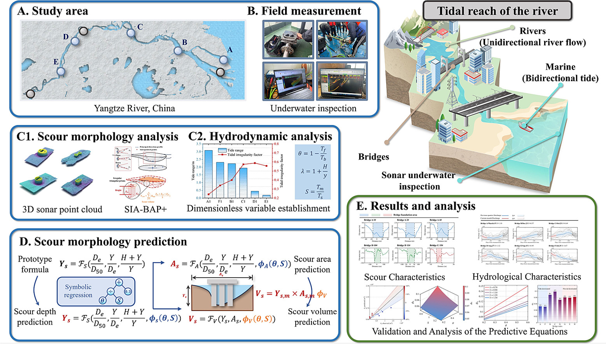

# 🌊 TRBrscour: Tidal-Reach Bridge Scour Database

  

  <em>Graphical abstract.</em>

---

## 🌉 Overview

**TRBrscour** is a field-based bridge scour database developed from processed measurement data of representative bridge foundations located in tidal reaches of the **Yangtze River, China**.

The database is intended to support the **development, validation, and benchmarking of data-driven models** for bridge local scour prediction under the combined effects of **river flow and tidal dynamics**.

The dataset includes:

* 🌉 Representative bridge scour features obtained from field measurements
* 🌊 Proposed **tidal irregularity factors**
* 📅 Proposed **River-flow seasonal factors**
* 💧 Proposed **Flow intensity factors**
* 📊 Computational results from baseline methods for model comparison

---

## ⭐ Acknowledgement

If this dataset is useful for your research, please consider **citing the associated paper** and giving this repository a ⭐.

> We hope that **TRBrscour** can contribute to further research on bridge scour prediction, tidal-reach hydraulics, scour morphology, and data-driven bridge safety assessment.

---

## 📚 Citation

If you use **TRBrscour** in your research, please cite the associated paper:

> **Huang, Z., Yang, Q., Zhu, Y., Xiong, W., & Xie, Y.**
> *Discovery and prediction of tidal reach bridge scour morphology via 3D underwater sonar point cloud.*
> **Automation in Construction**, Volume 192, 2026.
> 🔗 [ScienceDirect](https://www.sciencedirect.com/science/article/pii/S0926580526004930)

---

---

## 💡 Usage

Researchers are welcome to use **TRBrscour** for:

* Data-driven bridge scour prediction
* Benchmarking of bridge scour prediction methods
* Investigation of river–tide interaction effects
* Bridge hydraulic safety assessment

---

  🌊 <b>TRBrscour</b> · Field Data · Tidal Dynamics · Bridge Scour · Data-Driven Prediction

